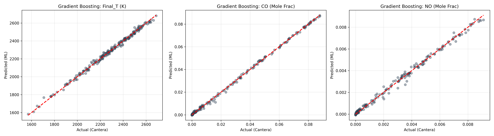
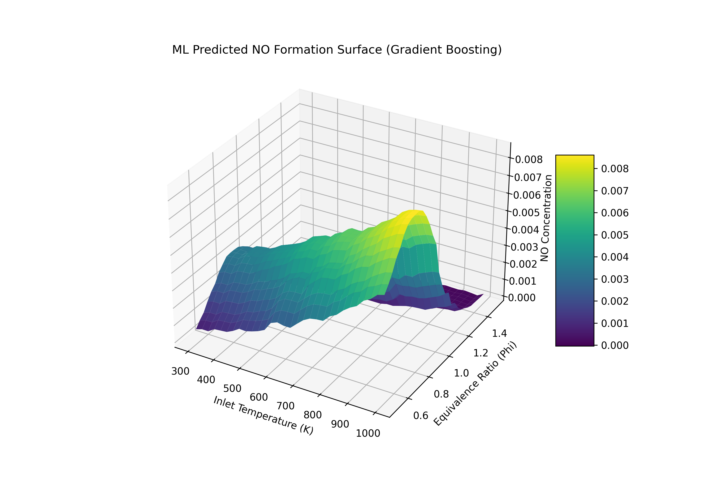
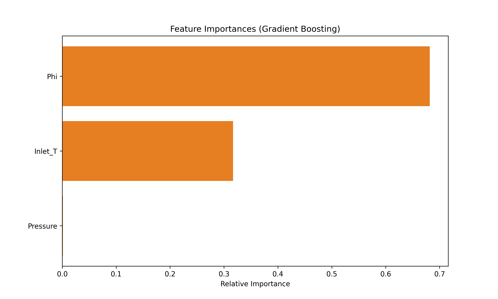

# Data Generation using Chemical Modelling and Simulation for ML

## Overview

This project fulfills the requirements for generating data using modelling and simulation for Machine Learning. We utilize **Cantera**, an open-source suite of tools for chemical kinetics and thermodynamics, to simulate the combustion of a Methane-Air mixture.

The goal is to build a "Virtual Lab" that predicts final combustion states (Temperature and Pollutants) based on initial conditions, and then evaluate which Machine Learning model best learns these underlying physical laws.

---

## Methodology

### Step 1 & 2: Simulator Selection and Installation

We have selected **Cantera** as our simulation engine due to its industry-standard accuracy in chemical equilibrium and kinetics. The environment is set up in Google Colab using `pip install cantera`.

### Step 3: Important Parameters & Bounds

The simulation focuses on a constant pressure, constant enthalpy reaction (**HP equilibrium**). We identified three critical parameters that influence combustion outcomes:

| Parameter | Lower Bound | Upper Bound | Unit |
| --- | --- | --- | --- |
| **Inlet Temperature (T_in)** | 300 | 1000 | Kelvin (K) |
| **Pressure (P)** | 1 | 50 | Atmosphere (atm) |
| **Equivalence Ratio (ϕ)** | 0.5 (Lean) | 1.5 (Rich) | Dimensionless |

### Step 4 & 5: Data Generation (1,000 Simulations)

We generated **1,000 random sets of parameters** using a uniform distribution within the bounds above. For each set, the simulator solves for the final equilibrium state using the **GRI-Mech 3.0** mechanism. We recorded three target variables:

1. **Final Flame Temperature (T_final)**
2. **CO (Carbon Monoxide)** mole fraction
3. **NO (Nitrogen Oxide)** mole fraction

---

## Step 6: Machine Learning Comparison & Results

We evaluated **6 different ML models** to determine which could most accurately map the input conditions to the three chemical outputs (Multi-Output Regression).

### Evaluation Results

| Model | R² Score | Mean Absolute Error (MAE) |
| --- | --- | --- |
| **Linear Regression** | 0.6998 | 46.13 |
| **Ridge Regression** | 0.6994 | 46.13 |
| **Decision Tree** | 0.9643 | 9.30 |
| **Random Forest** | 0.9903 | **4.30** |
| **SVR** | -0.2281 | 54.50 |
| **Gradient Boosting** | **0.9963** | 4.54 |

### Final Model Selection: Gradient Boosting

The **Gradient Boosting Regressor** was identified as the best performing model with a near-perfect **R² of 0.9963**. While Random Forest achieved a slightly lower MAE, Gradient Boosting proved superior at capturing the overall variance of the chemical equilibrium manifold.

---

## Visualizations

### 1. Regression Analysis (Predicted vs. Actual)

This plot shows the performance of the Gradient Boosting model. The tight clustering of points along the red dashed line (45°) demonstrates high predictive accuracy across all three targets.

### 2. 3D Physical Surface Analysis

This graph visualizes how the model understands the relationship between Temperature, Equivalence Ratio, and NO formation. It accurately captures the non-linear "peak" in NO formation.

### 3. Feature Importance

This chart highlights which input had the most impact on the final predictions. The **Equivalence Ratio (ϕ)** is the dominant factor in determining chemical outcomes.

---

## Conclusion

The failure of the **SVR (R² < 0)** compared to the success of **Gradient Boosting** suggests that the relationship between combustion parameters and emissions is highly non-linear. The ensemble-based boosting approach successfully localized these non-linearities, providing a robust "surrogate model" for expensive chemical simulations.

---

## Submission Details

* **Environment:** Google Colab
* **Language:** Python 3.x
* **Libraries:** `cantera`, `scikit-learn`, `pandas`, `numpy`, `matplotlib`
